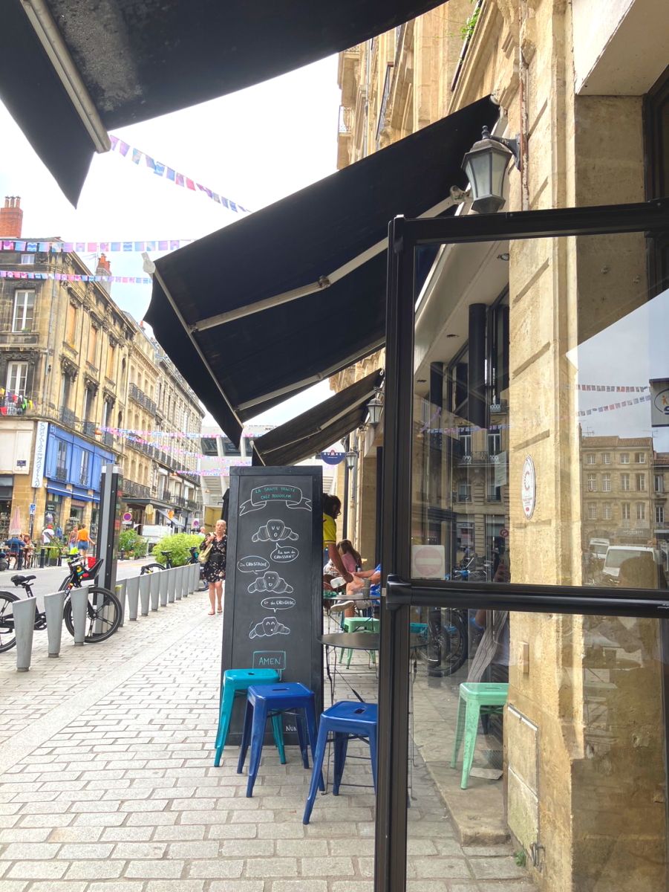
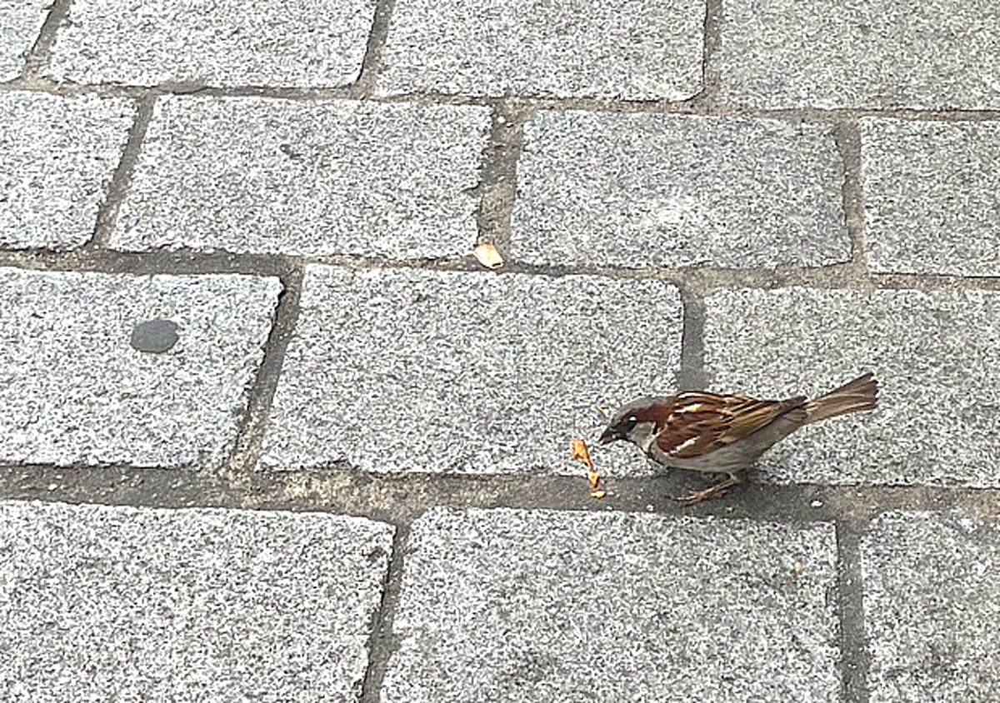
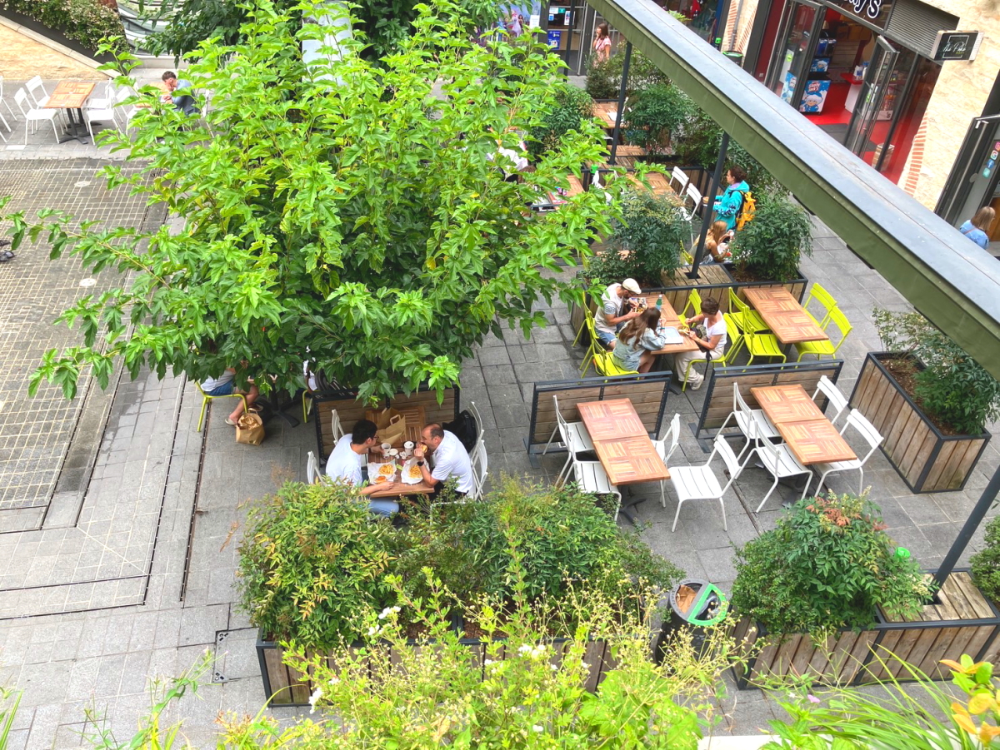
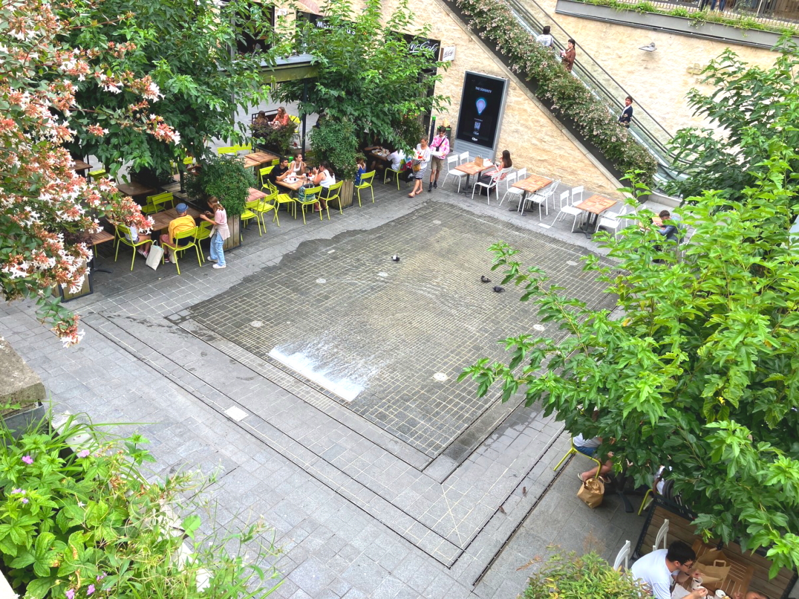
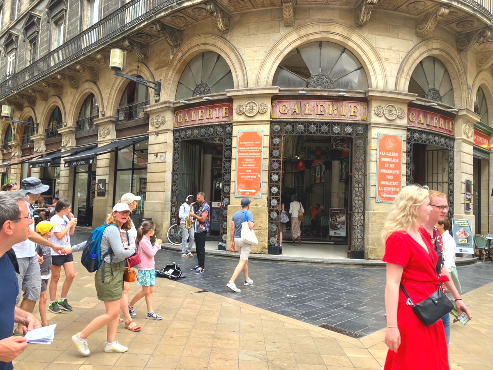
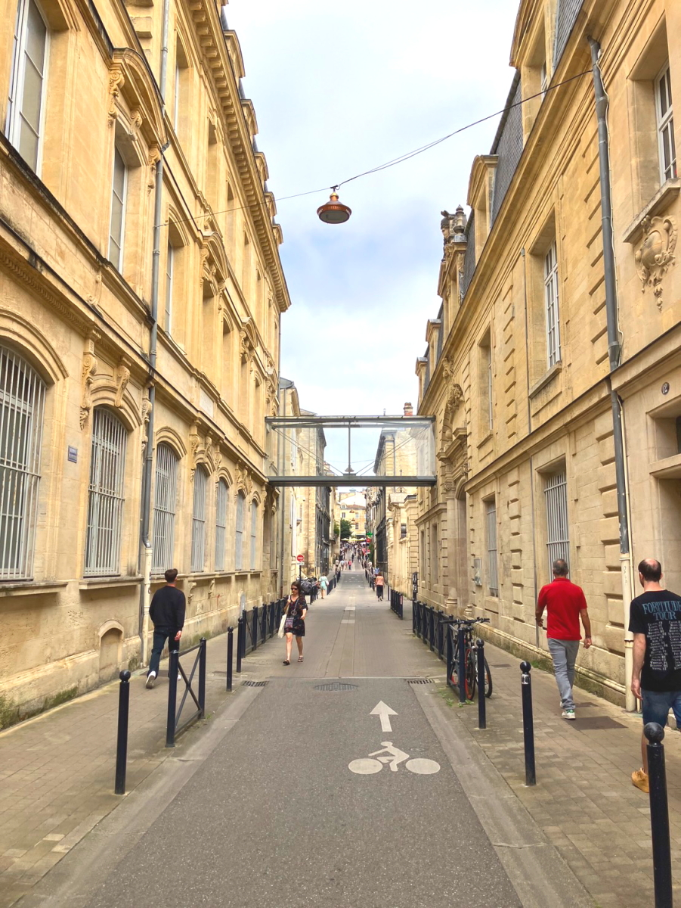
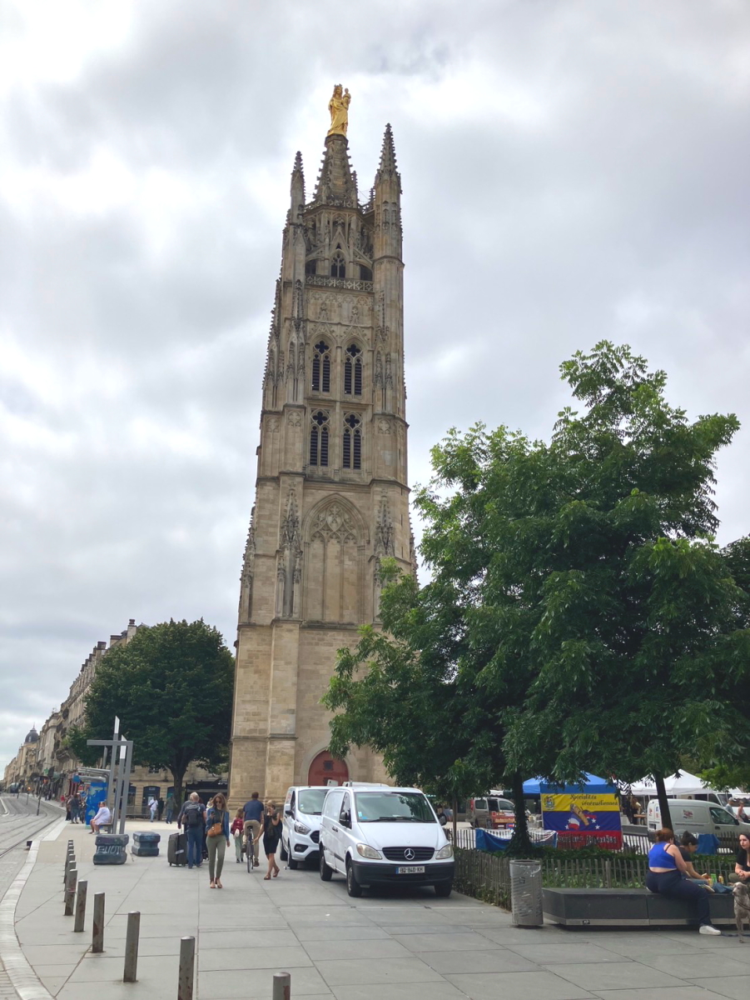

# 2024_paris4

<html lang="ja">
 <head>
  <meta charset="utf-8" />
 

<link href="https://cdnjs.cloudflare.com/ajax/libs/lightbox2/2.7.1/css/lightbox.css" rel="stylesheet">
   
</head>
<!--
<body onload="alert('65歳まで、よく頑張りました！　まだまだ元気に〜〜(^o^)/')" onunload="alert('再会の時まで、元気でお過ごしくださいませ〜(^o^)/')">
-->

  モバイル端末をお使いの場合は、画面を横向きにするとより見やすくご覧頂けます。

<!--
-->

<a href="https://torokoid.github.io/2024_paris/">2024年7月19日〜21日</a>><a href="https://torokoid.github.io/2024_paris/">22日〜23日</a>>23日〜
<!--
-->

 &nbsp;Bruce 23日〜

<!--
<h2><a href="https://torokoid.github.io/list">クラス会名簿リンク</a></h2>
-->
  

 アクセス用QRコード

<marquee direction="right" scrollamount="20" width="30%">(^_^)/~hada</marquee>

<h2><marquee behavior="left">!!! 2024年7月25日、パリオリンピック男子サッカー初戦、パラグアイ戦の模様を含むフランス情報 !!!</marquee></h2>
<!--

-->

<h3> ～～～2024年7月25日着の画像です！～～～  </h3>

<h3> ～～～今回の情報入手は、LINEホットラインでの以下のトンチンカンな会話からスタート～～～  </h3>

<h2><marquee behavior="left">!!! ボルドー散歩。パラグアイ人に会いました。日本人、パラグアイ人、我々以外いません。 試合当日、次女のお買い物に同行 !!!</marquee></h2>

<h2><marquee behavior="left">!!! バスで市内へ。Booking.comで予約したアパートに到着 !!!</marquee></h2>

<h3> ～～～予め連絡された暗証番号でドアを開けるだけです。市内観光へ。～～～  </h3>

<h2><marquee behavior="left">!!!サンミッシェル大聖堂の中に入った!!!</marquee></h2>

<h3> ～～～尖塔は工事中で入れず～～～  </h3>

<h2><marquee behavior="left">!!!次女のオススメレストランを目指して歩きました!!!</marquee></h2>

<h3> ～～～予約なしでしたが、二階の席に入れてくれました～～～  </h3>

<h3> ～～～ベルギービールのヒューガルデンを頼んだら、瓶がでてきてがっかり～～～  </h3>

<h3> ～～～フォワグラクリーム。普段食べない料理。茶碗蒸しとカツ丼の玉子とじの部分の味 
次女が注文したサーモンは普通に美味しかった～～～  </h3>

<h3> ～～～ボルドーの赤ワインを注文～～～  </h3>

<h2><marquee behavior="left">!!! 外の広場が騒がしくなってきた。ブラジルでは、これを道路、歩道でやってました。コンクリートの上でやるので体をはった芸です !!!</marquee></h2>

<h3> ～～～デザートにティラミスとチーズケーキ。英語が通じてないので、コーヒーの種類を説明するのに何回も確認～～～  </h3>

<h3> ～～～店内はおしゃれ。アルコールを飲んでいる人少ない。お食事をする場所でした～～～  </h3>

<h3> ～～～21時になっても明るいので、川沿いへ～～～  </h3>

<h3> ～～～噴水に馬があるのは珍しいかな～～～  </h3>

<h3> ～～～バスから見えた観覧車～～～  </h3>

<h3> ～～～川には大きな客船、遊覧船、ジェットスキー～～～  </h3>

<h3> ～～～だんだん暗くなってきたが、日中のように水蒸気がまかれた～～～  </h3>

<h3> ～～～日本の雰囲気を出した店～～～  </h3>

<h2><marquee behavior="left">!!!この後、すぐ寝てしまいました。3時頃起床。翌日に日本男子サッカーがあるのに日本人に会わず!!!</marquee></h2>

<h3> スター選手ゼロ、オーバーエイジなし。 
YOUTUBEの予想は2-1勝利。 
南米パラグアイは試合巧者。パラグアイは先制されないように気をつける。 
0-0でもいいという試合。日本はカウンターくらってヒヤヒヤ。 
暑いので、集中力のかけた見せ場のない試合を予想。 
0-0でいいと思っています  </h3>

      

                             

                             
        

  

 

<!-- フッタ -->
 <footer>
 <h3>Copyright 2024/Jul/25 S.Hada</h3>
 </footer>
